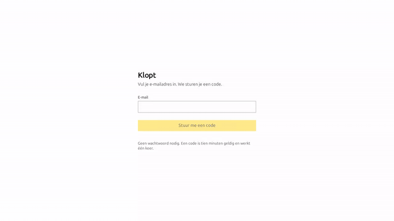

# Klopt

[](LICENSE)

**Open-source Dutch bookkeeping, and the start of an organisation backbone.**

## Demo

Short walkthrough of the self-hosted Alpha: sign-in, dashboard, a sales invoice, the journal, bank and purchase-inbox chrome, then settings and access.



[Download MP4 (~53s)](docs/demo/klopt-alpha-demo.mp4)

[Klopt](https://github.com/euro-oss/klopt) is the bookkeeping starter from
[euro.computer](https://euro.computer). The name is what a Dutch bookkeeper says
when the reconciliation lands: it adds up. The software is that same test,
built so a Dutch administration can be kept, exported, and automated.

It is **API-first** (the UI is a client of `/api/v1`), **AI-first** (an MCP
server on that same API), and **keyboard-first** (the daily screens are worked
from the keyboard). The licence is [Apache-2.0](LICENSE). Anyone may fork it,
host it, or sell a competing service. The repository belongs to
[euro-oss](https://github.com/euro-oss).

**Status: 0.1.0 Alpha**, self-hosted. You can keep a Dutch administration in
this today. `main` also carries unreleased interface work on top of that
release; the record is [`CHANGELOG.md`](CHANGELOG.md). A hosted EU service is
not part of this repository.

## Features

What is in 0.1.0, plus the unreleased screens already on `main`.

- **Ledger.** An append-only, hash-chained journal. Gapless numbering, period
  control, multi-currency, reversals, and year close. Trial balance, balance
  sheet, and profit and loss come from the same figures.
- **Dutch reference data.** RGS 3.7, loaded as data. XAF 3.2 export and import,
  checked against the published Belastingdienst schema. A new administration
  starts from a Dutch MKB chart under `reference-data/charts/`.
- **Sales.** Contacts, drafts, issued invoices, credit notes, UBL 2.1 validated
  as Peppol BIS Billing 3 with the NLCIUS rules, PDF, email, and dunning. A
  document that fails the schematron is not sent.
- **Purchases.** A document inbox for uploads and email, supplier invoices that
  keep the supplier's totals as stated, and an approval a person has to give.
- **Banking by file.** CAMT.053, MT940, and CSV import. A matching queue that
  suggests a booking and waits for confirmation. SEPA `pain.001` files that
  need two people, and neither of them a script.
- **VAT.** A BTW-aangifte derived from the journal, with a reconciliation on
  the report, and an ICP opgaaf with VIES checks. XBRL is generated. The
  filing path that works is the manual one.
- **Ready for a second person.** Several entities on one login, roles and
  permissions, an audit log, retention, sealed snapshots, and an Exact Online
  import that includes the document archive. Document storage is a local
  directory unless you point it at an S3 bucket; object lock is what that
  bucket is for.
- **One API, 118 operations** under `/api/v1` — the same operations the UI
  calls. OpenAPI is `GET /api/v1/openapi.json` on a running instance, and
  [`docs/openapi.json`](docs/openapi.json) in this tree. Scoped bearer tokens,
  an idempotency key on every write, and `application/problem+json` errors.
  Webhooks carry the event stream. Operators also get a CLI
  ([`apps/cli/README.md`](apps/cli/README.md)).
- **MCP, twelve tools.** Nine read: `describe_schema`, `search`, `get_balance`,
  `explain_number`, `list_open_items`, `vat_return_preview`,
  `list_pending_approvals`, `export_xaf`, `check_journal_entry`. Three draft a
  human still has to release: `draft_sales_invoice`,
  `capture_purchase_invoice`, `draft_from_inbox_item`. Nothing in the server
  posts, sends, files, or pays. A read-only token sees only the read tools.
  Point a client at `https://<your-host>/api/mcp` with
  `Authorization: Bearer klopt_…`, or run `apps/mcp` over stdio with
  `KLOPT_API_URL` and `KLOPT_TOKEN`. Issue the token under **Toegang**.
- **Keyboard-first UI**, in Dutch and English, light and dark. The keys that
  ship are [`docs/keyboard-map.md`](docs/keyboard-map.md).

Amounts on the wire are integer minor units **as strings**. A JSON number on a
money field is rejected.

### Not in this release

- **Digipoort.** Electronic filing to the Belastingdienst needs a PKIoverheid
  certificate and a signer this tree does not include. The transport stays
  unavailable; file the prepared return by hand. XBRL element names are still
  `verified: false` against the published Nederlandse Taxonomie, so electronic
  filing stays refused while that is true.
- **Peppol access point.** Outbound e-invoices leave by email, UBL and PDF
  attached. An access point needs a service-provider agreement and is not
  installed here.
- **PSD2 bank feed.** Statements come in as files: CAMT.053, MT940, or CSV.
  There is no bank-aggregator connection.
- **Hosted EU.** You run Klopt yourself. A hosted preview is a later milestone
  ([hosted-eu](https://github.com/euro-oss/klopt/milestone/3)), and it is not a
  service in this repository.

## Install and run

Node 22 or newer (`.nvmrc` is 24; CI also runs 26), pnpm 10 (`packageManager`
in `package.json`), and Docker for the local database.

```bash
git clone https://github.com/euro-oss/klopt.git
cd klopt
corepack enable
pnpm install
pnpm run peppol:fetch
cp .env.example .env
docker compose up -d
pnpm run build
pnpm --filter @klopt/db run migrate
pnpm run dev
```

Open <http://localhost:3000>.

`pnpm run peppol:fetch` downloads the OpenPeppol BIS Billing 3 Schematron.
Those files are not in git. See
[`reference-data/peppol/README.md`](reference-data/peppol/README.md).

Set `KLOPT_AUTH_SECRET` in `.env` before `pnpm run dev`
(`openssl rand -base64 32`). Every other variable is explained in
[`.env.example`](.env.example). With no SMTP configured, the sign-in code is
written to the web process log.

`pnpm run dev` starts the web app and the worker together. The worker polls
mailboxes into the purchase inbox, delivers webhooks, seals book years, and
pulls an Exact document archive when an import was asked for.
`pnpm run dev:web` and `pnpm run dev:worker` run them apart.

`docker compose up -d` starts Postgres 17 and MinIO, including an object-lock
bucket. `.env.example` points the `KLOPT_S3_*` variables at that MinIO. Leave
`KLOPT_S3_ENDPOINT` unset and documents stay in a local directory. An endpoint
set without the bucket name and credentials is refused at boot.

On a fresh install, sign-in leads to creating an administration: a name, an
optional KvK number, and a book year. That account is the owner.

### Docker

```bash
docker build -t klopt .
docker build -t klopt:headless --target headless .
docker run --rm --env-file .env klopt migrate
docker run --rm -p 3000:3000 --env-file .env klopt
```

Migrate is its own command. The image does not migrate on boot. `DATABASE_URL`
has to be reachable from inside the container — `localhost` there is the
container. The headless target serves the API and the worker and sets
`KLOPT_HEADLESS=1`. See the [`Dockerfile`](Dockerfile).

### Exact Online on a laptop

Exact refuses a plain `http` redirect URI. The local HTTPS path (portless,
`pnpm run dev:https`, `KLOPT_BASE_URL`) is the Exact section of
[`.env.example`](.env.example).

### The same checks CI runs

Postgres up, Schematron fetched, migrations applied, then:

```bash
pnpm run verify
```

That is format, build, lint, typecheck, test, and the architecture-boundary
check. The sequence, and what CI adds around it, is
[`CONTRIBUTING.md`](CONTRIBUTING.md).

## Roadmap

After this alpha, in this order. No dates.

1. **[beta-firm](https://github.com/euro-oss/klopt/milestone/1)** — listen to
   an accounting firm and stabilize: firm-feedback fixes and contributor
   governance. The pass written for that work is
   [`docs/audits/2026-09-alpha-maintainability-security-performance.md`](docs/audits/2026-09-alpha-maintainability-security-performance.md).
2. **[collaborators](https://github.com/euro-oss/klopt/milestone/2)** — deeper
   Dutch practice, and MCP and keyboard parity, with contributors outside the
   original authors.
3. **[hosted-eu](https://github.com/euro-oss/klopt/milestone/3)** — a hosted EU
   preview. It is not running. [`GOVERNANCE.md`](GOVERNANCE.md) records the
   intent for when it is: hosting sells operations and credentials, and the
   self-hosted build keeps the features.

0.1.0 is the original M0–M6 specification. The forward plan is the three
milestones above. [`CHANGELOG.md`](CHANGELOG.md) is the record of what landed.

## Contribute

Start here, then read [`CONTRIBUTING.md`](CONTRIBUTING.md) before a pull
request.

- **DCO, no CLA.** Every commit carries `Signed-off-by` (`git commit -s`).
  The text you are signing is <https://developercertificate.org>.
- **One logical change per pull request**, branched from current `main`,
  opened against `main`. Use the pull request template. The tip has to be
  green: `verify` on Node 24 and Node 26, `artefacts`, and `e2e`.
- **Review.** An appointed maintainer reviews. For now only Hidde merges to
  `main`. Names are in [`MAINTAINERS.md`](MAINTAINERS.md).
- **Security** goes through [`SECURITY.md`](SECURITY.md)
  (`security@euro.computer`), as a private report.
- This repository has no `CODE_OF_CONDUCT` file.

The code is free under Apache-2.0. The name is separate, and trademark
clearance has not been run: [`TRADEMARK.md`](TRADEMARK.md). Why the licence
stays Apache-2.0 is [`GOVERNANCE.md`](GOVERNANCE.md). Interim copyright is
[`NOTICE`](NOTICE).

### Further reading

Background, kept off the product pitch above.

- [`CHANGELOG.md`](CHANGELOG.md) — 0.1.0, and the unreleased work on `main`.
- [`docs/api-stability.md`](docs/api-stability.md) — the narrow promises that
  take a major version to break.
- [`docs/architecture.md`](docs/architecture.md) — layout and package
  boundaries. Deeper reading. A few paragraphs still describe an older
  bank-match keyboard and a missing theme toggle; the changelog is ahead of
  them.
- [`docs/ALPHA_ASSESSMENT.md`](docs/ALPHA_ASSESSMENT.md) — snapshot from
  2026-09-18. Historical. Planning uses the changelog and the beta-firm audit.
- [`docs/decisions/`](docs/decisions/) — accepted decisions, one file each.
